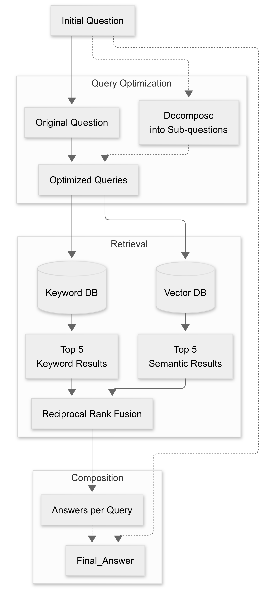

# MedHopQA Orekhovichi Submission
<p align="center">
  
</p>


A RAG (Retrieval-Augmented Generation) system for medical question answering, featuring a custom BM25S retriever integrated with LangChain.

## Project pipeline

<p align="center">
  
</p>

## 🚀 Quick Start

Prerequisites

- Python 3.10
- NVIDIA GPU with CUDA drivers (for Ollama inference)
- Ollama installed and configured

## Create and activate virtual environment
```bash
python3.10 -m venv venv
source venv/bin/activate  # Linux/MacOS
```

## or 
```
venv\Scripts\activate    # Windows
```

## Install dependencies
```bash
pip install -r requirements.txt
```

# 🧠 System Components

- Custom BM25S Retriever - Enhanced retrieval for medical documents
- Ollama Integration - GPU-accelerated inference
- LangChain Pipeline - End-to-end question answering
